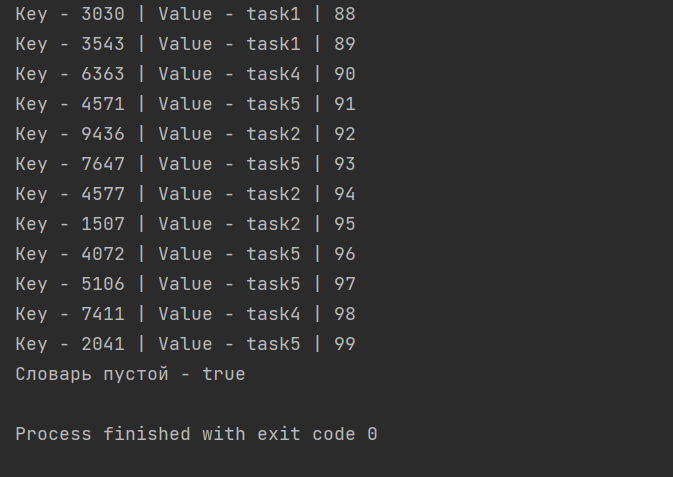
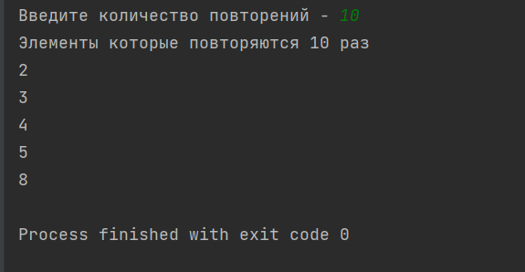
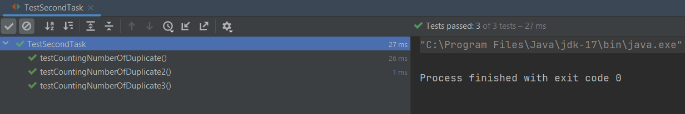

# Работа с Map в Java

### Первая задача

В первой задаче нужно написать программу, которая добавляет в словарь 100 случайных пар, целый ключ + значение строка,
затем считывает по ключам все значения и выводит, и затем удаляет все пары.

### Решение

Решение находится в классе FirstTask. Сначало мы создаем словарь с типом ключа Integer и String типом значения. Дальше создаем 
массив keys для генерации ключей нашего словаря, и создаем массив значений нашего словаря. Создаем объект random. После заполняем массив ключей случайными значениями, 
устанавливаем предел до 10000 (снижаем вероятность повторений ключей). Далее заполняем наш словарь foreach цикле проходя наш массив ключей. 
После проходим в цикле foreach наши ключи и выводим элементы нашего словаря.
После вывода удаляем элементы словаря, и в конце проверяем пустой ли наш словарь.

### Вывод

--------------------

### Вторая задача

Во второй задачае нужно написать функцию, которая получает список из 100 значений (сгенерируйте его заранее с числами в диапазоне от 1 до 10) и число N, 
и выдаёт список из тех значений в этом списке, которые повторяются не менее N раз. Используйте словарь для этого.

### Решение

Решение находится в классе SecondTask. Для начала мы вводим кол-во повторений значений в словаре, после заполняем список случайных значений, элементами от 1 до 10 с помощью stream. 
После у нас запускается метод который выводит повторяющие значения. В этом методе мы создаем словарь, создаем список для повторяющих n раз значений. Заполняем наш словарь.
После открываем цикл в цикле, где мы смотрим количество повторений всех 10 элементов, и если количество равно или больше значения n, то добавляем в наш список. В конце метода возвращаем наш список повторяющих элементов.

### Вывод

### Тесты

